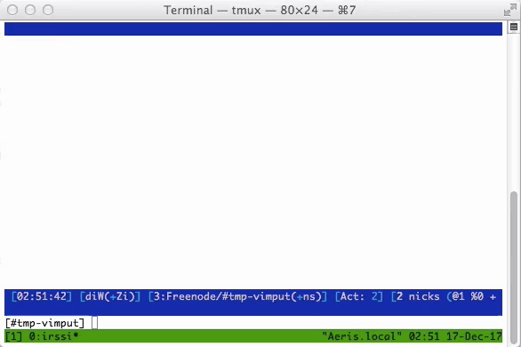

irssi-vimput
============

An Irssi plugin that opens the current input line in a new Tmux split in Vim.
When the Vim buffer is written, Irssi's prompt will be updated from the contents
of the buffer. For Vimmers, this makes it faster to make complicated edits to a
message.

# Demo

# Configuration
In order to use this script, a binding _must_ be configured to trigger it. For
example, to bind Ctrl-X:

	/BIND ^X command script exec Irssi::Script::vimput::vimput

## License
Copyright © 2017 Teddy Wing. Licensed under the GNU GPLv3+ (see the included
COPYING file).
